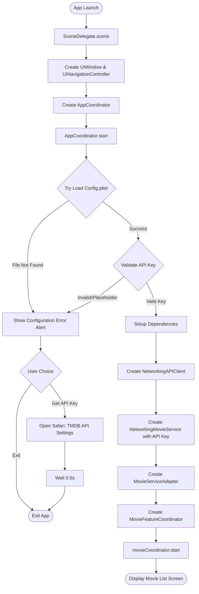
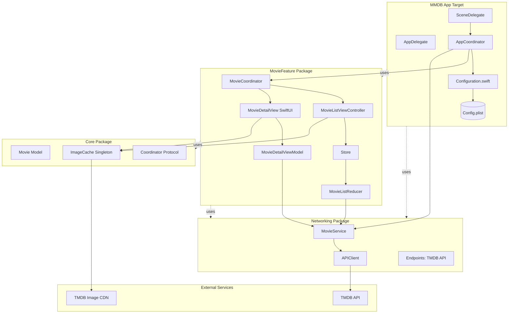
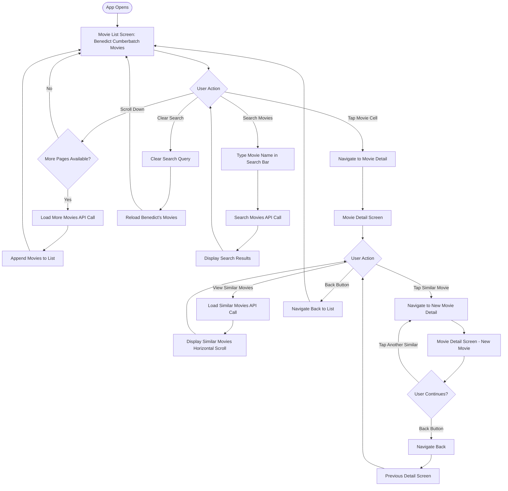
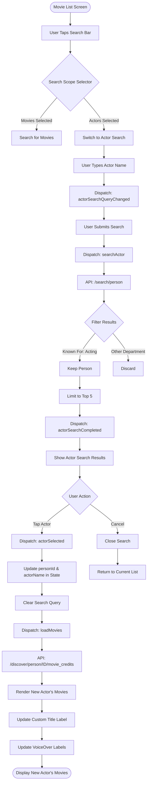
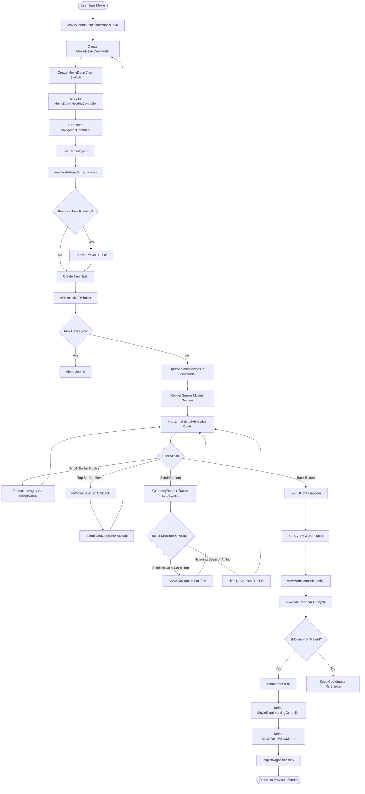
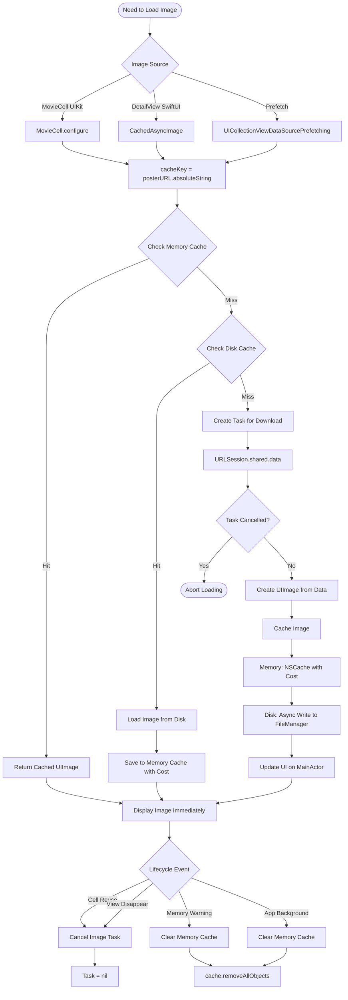
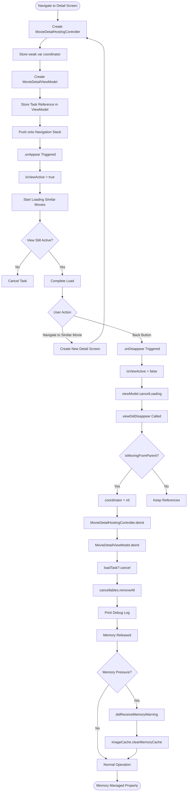
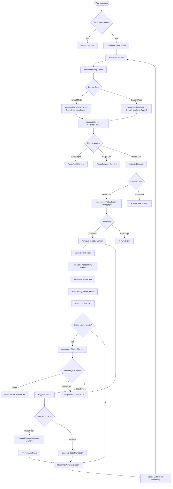
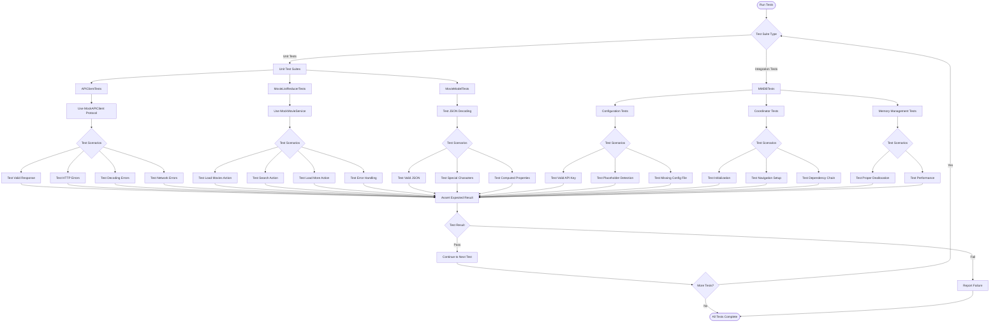

# MMDB App Flowcharts

This document contains comprehensive flowcharts showing the architecture and user flows of the MMDB app.

---

## 1. App Launch & Configuration Flow



---

## 2. Architecture Overview



---

## 3. Main User Journey Flow



---

## 4. Actor Search Flow



---

## 5. Movie Detail & Similar Movies Flow



---

## 6. TCA-Inspired State Management Flow

```mermaid
flowchart TD
    Start([User Interaction]) --> Dispatch[Dispatch Action to Store]
    Dispatch --> StoreReceive[Store.dispatch(action)]
    StoreReceive --> CallReducer[Reducer.reduce(state, action)]
    
    CallReducer --> UpdateState[Update State]
    UpdateState --> CreateEffect{Effect Needed?}
    
    CreateEffect -->|Effect.none| PublishState[Publish State to Subscribers]
    CreateEffect -->|Effect.task| ExecuteTask[Execute Async Task]
    
    ExecuteTask --> RunAsync[Run Async Operation]
    RunAsync --> APICall{API Call Type}
    
    APICall -->|Fetch Movies| FetchMovies[MovieService.fetchMoviesByPerson]
    APICall -->|Search Movies| SearchMovies[MovieService.searchMovies]
    APICall -->|Search Actor| SearchActor[MovieService.searchPerson]
    APICall -->|Similar Movies| SimilarMovies[MovieService.fetchSimilarMovies]
    
    FetchMovies --> NetworkLayer[Networking Layer]
    SearchMovies --> NetworkLayer
    SearchActor --> NetworkLayer
    SimilarMovies --> NetworkLayer
    
    NetworkLayer --> HTTPRequest[APIClient.request]
    HTTPRequest --> TMDBAPI[TMDB API Server]
    TMDBAPI --> ParseResponse{Response Status}
    
    ParseResponse -->|Success| DecodeJSON[Decode JSON Response]
    ParseResponse -->|Error| CreateErrorAction[Create Error Action]
    
    DecodeJSON --> CreateSuccessAction[Create Success Action]
    CreateSuccessAction --> DispatchResult[Dispatch Result Action to Store]
    CreateErrorAction --> DispatchResult
    
    DispatchResult --> CallReducer
    PublishState --> UpdateUI[UI Components Observe State]
    UpdateUI --> RenderView[Re-render View]
    RenderView --> End([Updated UI Displayed])
```

---

## 7. Image Caching & Loading Flow



---

## 8. Memory Management Flow (VoiceOver & Deep Navigation)



---

## 9. Accessibility (VoiceOver) Flow



---

## 10. Testing Flow



---

## Legend

### Shapes
- **Rounded Rectangle**: Process/Action
- **Diamond**: Decision Point
- **Circle**: Start/End Point
- **Rectangle with Double Lines**: Subroutine/Module
- **Cylinder**: Data Storage

### Colors (if rendered)
- **Blue**: UI Layer
- **Green**: Business Logic
- **Orange**: Network Layer
- **Purple**: Data/Cache Layer
- **Red**: Error/Alert Flow

---

## Key Architectural Patterns

1. **Coordinator Pattern**: Navigation and flow control
2. **TCA-Inspired**: Unidirectional data flow with State/Action/Reducer
3. **Protocol-Oriented**: Dependency injection and testability
4. **Async/Await**: Modern Swift concurrency
5. **Memory Safety**: Weak references, task cancellation, lifecycle management
6. **Accessibility-First**: Comprehensive VoiceOver support

---

## Author
Tushar Chitnavis

